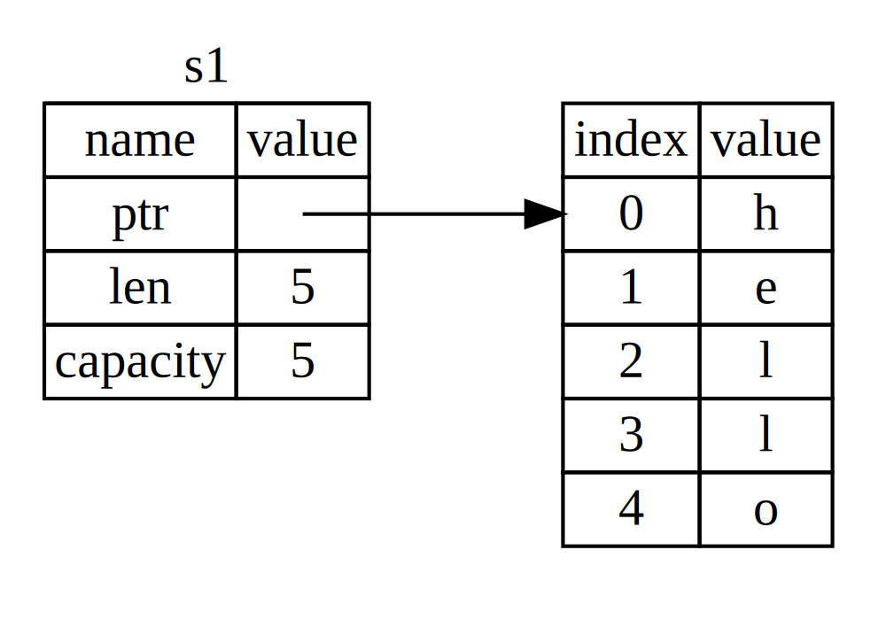
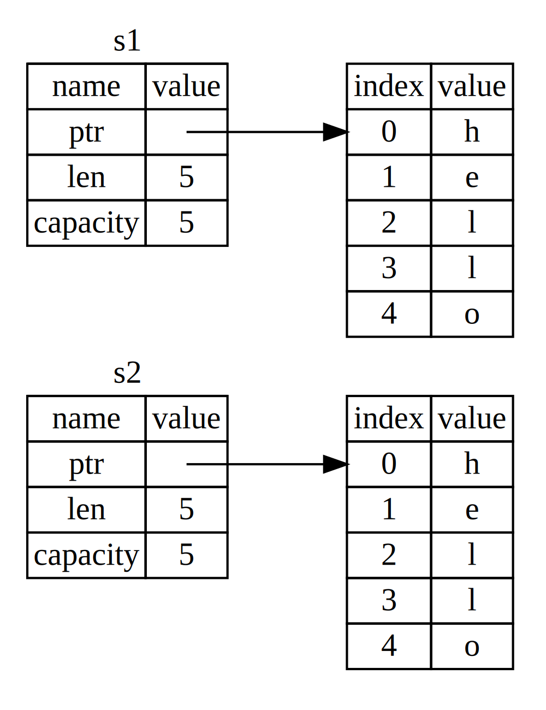

*所有权*是一组管理 Rust 程序如何使用内存的规则。所有程序都必须管理它们在运行时如何使用计算机的内存。一些语言有垃圾回收机制，会在程序运行时定期查找不再使用的内存；在其他语言中，程序员必须显式地分配和释放内存。Rust 使用第三种方法：内存通过所有权系统来管理，该系统有一组编译器检查的规则。如果违反了任何一条规则，程序将无法编译。所有权的任何特性都不会在程序运行时减慢其速度。

因为所有权对许多程序员来说是一个新概念，所以确实需要一些时间来适应。好消息是，随着你对 Rust 和所有权系统规则的经验越来越丰富，你会发现自然而然地编写出安全和高效的代码变得更加容易。坚持下去！

当你理解了所有权，你就会为理解那些使 Rust 与众不同的特性打下坚实的基础。在本章中，你将通过一些侧重于一个非常常见的数据结构的示例来学习所有权：字符串。

> ### 栈与堆
>
> 许多编程语言不要求你经常思考栈与堆。但在像 Rust 这样的系统编程语言中，一个值是在栈上还是在堆上会影响语言的行为以及为什么你必须做出某些决定。所有权的一些部分将在本章后面结合栈与堆来说明，所以这里先做一个简要说明作为准备。
>
> 栈与堆都是你的代码在运行时可以使用的内存部分，但它们的结构不同。栈按照它获取值的顺序存储值，并以相反的顺序移除值。这被称为*后进先出（LIFO）*。想想一叠盘子：当你添加更多盘子时，你把它们放在堆叠的顶部，当你需要一个盘子时，你从顶部取一个。从中间或底部添加或移除盘子效果不会那么好！添加数据被称为*压入栈*，移除数据被称为*弹出栈*。所有存储在栈上的数据必须有已知且固定的大小。在编译时大小未知或大小可能改变的数据必须存储在堆上。
>
> 堆的组织性较差：当你把数据放在堆上时，你请求一定数量的空间。内存分配器在堆中找到一个足够大的空位，标记为正在使用，并返回一个*指针*，即该位置的地址。这个过程被称为*在堆上分配*，有时简称为*分配*（将值压入栈不被认为是分配）。因为指向堆的指针是已知且固定大小的，你可以将指针存储在栈上，但当你想要实际数据时，你必须跟随指针。想想在一家餐厅就座。当你进入时，你说出你团队的人数，然后主人会找到一个能容纳所有人的空桌子并带你们过去。如果你团队中有人迟到了，他们可以询问你们坐在哪里来找到你。
>
> 将数据压入栈比在堆上分配更快，因为分配器永远不必搜索存储新数据的位置；那个位置总是在栈的顶部。相比之下，在堆上分配空间需要更多的工作，因为分配器必须首先找到足够大的空间来容纳数据，然后记账为下一次分配做准备。
>
> 访问堆中的数据通常比访问栈中的数据慢，因为你必须跟随指针才能到达那里。如果现代处理器在内存中跳跃较少，它们会更快。继续这个类比，考虑一个餐厅的服务员从多张桌子点餐。最有效的方式是在移动到下一个桌子之前把一张桌子的所有订单都点完。从A桌点一个菜，然后从B桌点一个菜，然后再从A桌点一个菜，再从B桌点一个菜会是一个慢得多的过程。同样，处理器在处理与其他数据接近的数据时（就像在栈上一样），通常比处理距离较远的数据（就像在堆上一样）能更好地完成工作。
>
> 当你的代码调用一个函数时，传入函数的值（包括可能指向堆上数据的指针）和函数的局部变量被压入栈。当函数结束时，这些值从栈中弹出。
>
> 跟踪代码的哪些部分正在使用堆上的什么数据，最小化堆上的重复数据量，以及清理堆上未使用的数据以免空间耗尽，这些都是所有权解决的问题。一旦你理解了所有权，你就不需要经常思考栈与堆了。但知道所有权的主要目的是管理堆数据有助于解释它为什么以这种方式工作。

## 所有权规则

首先，让我们看看所有权规则。在我们浏览说明这些规则的示例时，请牢记这些规则：

- Rust 中的每个值都有一个*所有者*。
- 同一时间只能有一个所有者。
- 当所有者离开作用域时，该值将被丢弃。

## 变量作用域

现在我们已经掌握了基本的 Rust 语法，我们不会在示例中包含所有的 `fn main() {` 代码，所以如果你要跟随操作，请确保手动将以下示例放入 `main` 函数中。因此，我们的示例会更加简洁，让我们专注于实际细节而不是样板代码。

作为所有权的第一个示例，我们将查看一些变量的作用域。*作用域*是程序中某个项目有效的范围。以下面的变量为例：

```rust
let s = "hello";
```

变量 `s` 引用一个字符串字面量，其中字符串的值被硬编码到我们程序的文本中。该变量从声明点起到当前作用域结束都是有效的。**清单 4-1** 展示了一个程序，带有注释说明变量 `s` 在哪些地方是有效的。

**清单 4-1**：变量及其有效的作用域

```rust
fn main() {
    {                      // s 在这里无效，因为它尚未声明
        let s = "hello";   // s 从这里开始有效

        // 使用 s 做一些事情
    }                      // 这个作用域现在结束了，s 不再有效
}
```

换句话说，这里有两个重要的时间点：

- 当 `s` 进入*作用域*时，它是有效的。
- 它保持有效直到它离开*作用域*。

在这一点上，作用域和变量何时有效之间的关系与其他编程语言类似。现在我们将在这个理解的基础上引入 `String` 类型。

## `String` 类型

为了说明所有权规则，我们需要一种比第 3 章["数据类型"][数据类型] 部分介绍的类型更复杂的数据类型。之前介绍的类型大小已知，可以存储在栈上，当它们的作用域结束时从栈中弹出，如果需要，可以快速简单地复制以创建一个独立的实例。但我们想要查看存储在堆上的数据，并探索 Rust 如何知道何时清理这些数据，`String` 类型是一个很好的例子。

我们将重点关注与所有权相关的 `String` 部分。这些方面同样适用于其他复杂数据类型，无论它们是由标准库提供的还是由你创建的。我们将在[第 8 章][ch8] 讨论 `String` 的非所有权方面。

我们已经见过字符串字面量，其中字符串值被硬编码到我们的程序中。字符串字面量很方便，但它们并不适用于我们可能想要使用文本的所有情况。一个原因是它们是不可变的。另一个是并非所有字符串值在我们编写代码时都能知道：例如，如果我们想要获取用户输入并存储它呢？正是为了这些情况 Rust 才有 `String` 类型。这种类型管理在堆上分配的数据，因此能够存储我们在编译时未知数量的文本。你可以使用 `from` 函数从字符串字面量创建一个 `String`，如下所示：

```rust
let s = String::from("hello");
```

双冒号 `::` 运算符允许我们将这个特定的 `from` 函数命名空间放在 `String` 类型下，而不是使用某种像 `string_from` 这样的名称。我们将在第 5 章的["方法"][方法] 部分讨论更多这种语法，并在第 7 章的["在模块树中引用条目的路径"][模块树路径] 中讨论使用模块进行命名空间。

这种字符串*可以*被修改：

```rust
fn main() {
    let mut s = String::from("hello");

    s.push_str(", world!"); // push_str() 将一个字面量追加到 String

    println!("{s}"); // 这将打印 `hello, world!`
}
```

那么，这里的区别是什么？为什么 `String` 可以被修改而字面量不能？区别在于这两种类型如何处理内存。

## 内存和分配

在字符串字面量的情况下，我们在编译时就知道内容，所以文本直接硬编码到最终的可执行文件中。这就是字符串字面量快速高效的原因。但这些特性只来自字符串字面量的不可变性。不幸的是，我们不能为每个在编译时大小未知且大小可能在程序运行时改变的文本片段将一块内存放入二进制文件中。

使用 `String` 类型，为了支持可变的、可增长的文本片段，我们需要在堆上分配一定数量的内存，在编译时未知，以容纳内容。这意味着：

- 内存必须在运行时从内存分配器请求。
- 我们需要一种方式在我们使用完 `String` 时将这块内存返回给分配器。

第一部分由我们完成：当我们调用 `String::from` 时，它的实现请求它需要的内存。这在编程语言中几乎是一样的。

然而，第二部分是不同的。在有*垃圾回收器（GC）*的语言中，GC 会跟踪并清理不再使用的内存，我们不需要考虑它。在大多数没有 GC 的语言中，识别内存何时不再被使用并调用代码显式释放它是我们的责任，就像我们在请求内存时做的那样。正确执行这一直以来都是一个困难的编程问题。如果我们忘记了，我们会浪费内存。如果我们做得太早，我们会得到一个无效变量。如果我们做两次，那也是一个 bug。我们需要将一次 `allocate` 与一次 `free` 配对。

Rust 采取不同的路径：一旦拥有它的变量离开作用域，内存就会自动返回。下面是我们的作用域示例的一个版本，使用 `String` 而不是字符串字面量：

```rust
fn main() {
    {
        let s = String::from("hello"); // s 从这里开始有效

        // 使用 s 做一些事情
    }                                  // 这个作用域现在结束了，s 不再
                                       // 有效
}
```

有一个自然的点可以返回我们 `String` 需要的内存给分配器：当 `s` 离开作用域时。当一个变量离开作用域时，Rust 为我们调用一个特殊函数。这个函数称为 `drop`，它是 `String` 的作者放置返回内存代码的地方。Rust 在结束的大括号处自动调用 `drop`。

> 注意：在 C++ 中，这种在项生命周期结束时释放资源的模式有时被称为*资源获取即初始化（RAII）*。如果你使用过 RAII 模式，Rust 中的 `drop` 函数对你来说会很熟悉。

这种模式对 Rust 代码的编写方式有深远的影响。现在看起来很简单，但当我们想要让多个变量使用我们在堆上分配的数据时，代码的行为在更复杂的情况下可能会出乎意料。让我们现在探索一些这样的情况。

### 变量与数据的交互：移动

多个变量可以以不同的方式在 Rust 中与相同的数据交互。清单 4-2 展示了一个使用整数的例子。

**清单 4-2**：将变量 `x` 的整数值赋给 `y`

```rust
fn main() {
    let x = 5;
    let y = x;
}
```

我们大概可以猜到这是做什么的："将值 `5` 绑定到 `x`；然后，复制 `x` 中的值并将其绑定到 `y`。"我们现在有两个变量，`x` 和 `y`，都等于 `5`。这确实是正在发生的事情，因为整数是具有已知且固定大小的简单值，这两个 `5` 值被压入栈中。

现在让我们看看 `String` 版本：

```rust
fn main() {
    let s1 = String::from("hello");
    let s2 = s1;
}
```

这看起来非常相似，所以我们可能假设它的工作方式也是一样的：也就是说，第二行会复制 `s1` 中的值并将其绑定到 `s2`。但这并不是实际发生的事情。

看看图 4-1，看看 `String` 在底层发生了什么。一个 `String` 由三部分组成，如左图所示：一个指向存储字符串内容的内存的指针、一个长度和一个容量。这组数据存储在栈上。右边是堆上存储内容的内存。



*图 4-1：绑定到 `s1`、保存值 `"hello"` 的 `String` 在内存中的表示*

长度是 `String` 的内容当前使用的内存量，以字节为单位。容量是 `String` 从分配器接收的内存总量，以字节为单位。长度和容量之间的差异很重要，但在这个上下文中无关紧要，所以现在可以忽略容量。

当我们将 `s1` 赋给 `s2` 时，`String` 数据被复制，意味着我们复制栈上的指针、长度和容量。我们不复制指针所指向的堆上的数据。换句话说，内存中的数据表示看起来像图 4-2。


*图 4-2：变量 `s2` 拥有 `s1` 的指针、长度和容量的副本在内存中的表示*

该表示*不*像图 4-3，如果 Rust 也复制堆数据，内存会是这样的。如果 Rust 这样做，如果堆上的数据很大，`s2 = s1` 操作在运行时性能方面可能会非常昂贵。



*图 4-3：如果 Rust 也复制堆数据，`s2 = s1` 可能会做的另一种可能性*

之前我们说，当一个变量离开作用域时，Rust 会自动调用 `drop` 函数并清理该变量的堆内存。但是图 4-2 显示两个数据指针指向相同的位置。这是一个问题：当 `s2` 和 `s1` 离开作用域时，它们都会尝试释放相同的内存。这被称为*双重释放*错误，是我们之前提到的内存安全 bug 之一。释放内存两次可能导致内存损坏，这可能导致安全漏洞。

为了确保内存安全，在 `let s2 = s1;` 这一行之后，Rust 认为 `s1` 不再有效。因此，当 `s1` 离开作用域时，Rust 不需要释放任何东西。看看当你尝试在 `s2` 创建后使用 `s1` 时会发生什么；它不会工作：

```rust
fn main() {
    let s1 = String::from("hello");
    let s2 = s1;

    println!("{s1}, world!");
}
```

你会得到一个像这样的错误，因为 Rust 阻止你使用无效的引用：

```console
$ cargo run
   Compiling ownership v0.1.0 (file:///projects/ownership)
error[E0382]: borrow of moved value: `s1`
 --> src/main.rs:5:16
  |
2 |     let s1 = String::from("hello");
  |         -- move occurs because `s1` has type `String`, which does not implement the `Copy` trait
3 |     let s2 = s1;
  |              -- value moved here
4 |
5 |     println!("{s1}, world!");
  |                ^^ value borrowed here after move
  |
  = note: this error originates in the macro `$crate::format_args_nl` which comes from the expansion of the macro `println` (in Nightly builds, run with -Z macro-backtrace for more info)
help: consider cloning the value if the performance cost is acceptable
  |
3 |     let s2 = s1.clone();
  |                ++++++++

For more information about this error, try `rustc --explain E0382`.
error: could not compile `ownership` (bin "ownership") due to 1 previous error
```

如果你在使用其他语言时听说过*浅拷贝*和*深拷贝*这些术语，不复制数据而只复制指针、长度和容量的概念听起来像在做浅拷贝。但因为 Rust 也使第一个变量无效，它不再被称为浅拷贝，而是被称为*移动*。在这个例子中，我们会说 `s1` 被*移动*到了 `s2` 中。所以，实际发生的情况如图 4-4 所示。


*图 4-4：`s1` 被使无效后内存中的表示*

这就解决了我们的问题！只有 `s2` 有效，当它离开作用域时，它会独自释放内存，我们就完成了。

此外，这隐含着一个设计选择：Rust 永远不会自动创建数据的"深"拷贝。因此，任何*自动*复制在运行时性能方面都可以被认为是廉价的。

### 作用域和赋值

对于作用域、所有权和通过 `drop` 函数释放内存之间的关系，相反的情况也是成立的。当你给一个现有变量分配一个全新的值时，Rust 会立即调用 `drop` 并释放原始值的内存。例如，考虑这段代码：

```rust
fn main() {
    let mut s = String::from("hello");
    s = String::from("ahoy");

    println!("{s}, world!");
}
```

我们最初声明一个变量 `s` 并将它绑定到一个值为 `"hello"` 的 `String`。然后，我们立即创建一个值为 `"ahoy"` 的新 `String` 并将其赋给 `s`。此时，堆上的原始值不再被任何东西引用。图 4-5 说明了此时的栈与堆数据：


*图 4-5：初始值被完全替换后内存中的表示*

因此原始字符串立即离开作用域。Rust 会在其上运行 `drop` 函数，其内存会立即被释放。当我们在最后打印值时，它将是 `"ahoy, world!"`。

### 变量与数据的交互：克隆

如果我们*确实*想要深度复制 `String` 的堆数据，而不仅仅是栈数据，我们可以使用一个名为 `clone` 的常见方法。我们将在第 5 章讨论方法语法，但因为方法是许多编程语言中的常见特性，你可能之前见过它们。

下面是 `clone` 方法的一个例子：

```rust
fn main() {
    let s1 = String::from("hello");
    let s2 = s1.clone();

    println!("s1 = {s1}, s2 = {s2}");
}
```

这工作得很好，并明确地产生了图 4-3 中显示的行为，即堆数据*确实*被复制了。

当你看到对 `clone` 的调用时，你知道正在执行一些任意代码，而这些代码可能很昂贵。这是一个视觉指示器，表明正在发生一些不同的事情。

### 仅栈数据：复制

还有一个我们尚未讨论的细节。这段使用整数的代码——其中一部分在清单 4-2 中显示——可以工作并且是有效的：

```rust
fn main() {
    let x = 5;
    let y = x;

    println!("x = {x}, y = {y}");
}
```

但这似乎与我们刚学到的东西相矛盾：我们没有调用 `clone`，但 `x` 仍然有效，并没有被移动到 `y` 中。

原因是像整数这样在编译时大小已知的类型完全存储在栈上，所以实际值的复制很快。这意味着在我们创建变量 `y` 后，没有理由阻止 `x` 有效。换句话说，这里的深拷贝和浅拷贝没有区别，所以调用 `clone` 不会与通常的浅拷贝做任何不同的事情，我们可以省略它。

Rust 有一个称为 `Copy` trait 的特殊注解，我们可以将其放在存储在栈上的类型上，就像整数一样（我们将在[第 10 章][traits] 中更多地讨论 trait）。如果一个类型实现了 `Copy` trait，使用它的变量不会移动，而是会被平凡地复制，使它们在赋值给另一个变量后仍然有效。

如果类型或其任何部分实现了 `Drop` trait，Rust 将不允许我们用 `Copy` 注解该类型。如果该类型在值离开作用域时需要发生一些特殊的事情，并且我们向该类型添加了 `Copy` 注解，我们会得到一个编译时错误。要了解如何向你的类型添加 `Copy` 注解以实现该 trait，请参阅附录 C 中的["可派生 trait"][可派生trait]。

那么，哪些类型实现了 `Copy` trait 呢？你可以检查给定类型的文档来确定，但作为一般规则，任何简单标量值的组都可以实现 `Copy`，任何需要分配或某种形式资源的都不能实现 `Copy`。以下是一些实现了 `Copy` 的类型：

- 所有整数类型，例如 `u32`。
- 布尔类型 `bool`，其值为 `true` 和 `false`。
- 所有浮点类型，例如 `f64`。
- 字符类型 `char`。
- 元组，如果它们只包含也实现 `Copy` 的类型。例如，`(i32, i32)` 实现了 `Copy`，但 `(i32, String)` 没有。

## 所有权和函数

将值传递给函数的机制与将值赋值给变量的机制相似。将变量传递给函数将移动或复制，就像赋值一样。清单 4-3 有一个例子，带有一些注释，显示变量何时进入和离开作用域。

**清单 4-3**：带有所有权和作用域注释的函数（文件名：*src/main.rs*）

```rust
fn main() {
    let s = String::from("hello");  // s 进入作用域

    takes_ownership(s);             // s 的值移动到函数中...
                                    // ... 所以在这里不再有效

    let x = 5;                      // x 进入作用域

    makes_copy(x);                  // 因为 i32 实现了 Copy trait，
                                    // x 不会移动到函数中，
                                    // 所以之后使用 x 是可以的。

} // 这里，x 先离开作用域，然后是 s。然而，因为 s 的值被移动了，
  // 所以不会发生什么特别的事情。

fn takes_ownership(some_string: String) { // some_string 进入作用域
    println!("{some_string}");
} // 这里，some_string 离开作用域并调用 `drop`。其后备
  // 内存被释放。

fn makes_copy(some_integer: i32) { // some_integer 进入作用域
    println!("{some_integer}");
} // 这里，some_integer 离开作用域。不会发生什么特别的事情。
```

如果我们在调用 `takes_ownership` 后尝试使用 `s`，Rust 会抛出一个编译时错误。这些静态检查保护我们免于错误。尝试向 `main` 添加使用 `s` 和 `x` 的代码，看看你在哪里可以使用它们，以及所有权规则在哪里阻止你这样做。

## 返回值和作用域

返回值也可以转移所有权。清单 4-4 展示了一个返回某些值的函数示例，其注释与清单 4-3 中的类似。

**清单 4-4**：转移返回值的所有权（文件名：*src/main.rs*）

```rust
fn main() {
    let s1 = gives_ownership();        // gives_ownership 将其返回
                                       // 值移动到 s1

    let s2 = String::from("hello");    // s2 进入作用域

    let s3 = takes_and_gives_back(s2); // s2 被移动到
                                       // takes_and_gives_back，后者也
                                       // 将其返回值移动到 s3
} // 这里，s3 离开作用域并被丢弃。s2 被移动了，所以什么也不会
  // 发生。s1 离开作用域并被丢弃。

fn gives_ownership() -> String {       // gives_ownership 将其
                                       // 返回值移动到调用它的
                                       // 函数

    let some_string = String::from("yours"); // some_string 进入作用域

    some_string                        // some_string 被返回并
                                       // 移动到调用
                                       // 函数
}

// 这个函数接受一个 String 并返回一个 String。
fn takes_and_gives_back(a_string: String) -> String {
    // a_string 进入
    // 作用域

    a_string  // a_string 被返回并移动到调用函数
}
```

变量的所有权每次都遵循相同的模式：将值赋值给另一个变量会移动它。当包含堆上数据的变量离开作用域时，该值将被 `drop` 清理，除非数据的所有权已移动到另一个变量。

虽然这有效，但每次函数都获取所有权然后返回所有权有点繁琐。如果我们想要让一个函数使用一个值但不获取所有权怎么办？很麻烦的是，我们传入的任何东西如果我们想再次使用它也需要传回，此外，我们可能还想返回函数主体产生的任何数据。

Rust 确实允许我们使用元组返回多个值，如清单 4-5 所示。

**清单 4-5**：返回参数的所有权（文件名：*src/main.rs*）

```rust
fn main() {
    let s1 = String::from("hello");

    let (s2, len) = calculate_length(s1);

    println!("The length of '{s2}' is {len}.");
}

fn calculate_length(s: String) -> (String, usize) {
    let length = s.len(); // len() 返回 String 的长度

    (s, length)
}
```

但这对于一个应该是常见的概念来说太过繁琐和大量工作。幸运的是，Rust 有一个特性可以在不转移所有权的情况下使用值：引用。

[数据类型]: /rust-book/ch03-02-data-types/#数据类型
[ch8]: /rust-book/ch08-02-strings/
[traits]: /rust-book/ch10-02-traits/
[可派生trait]: /rust-book/appendix-03-derivable-traits/
[方法]: /rust-book/ch05-03-method-syntax/#方法
[模块树路径]: /rust-book/ch07-03-paths-for-referring-to-an-item-in-the-module-tree/
