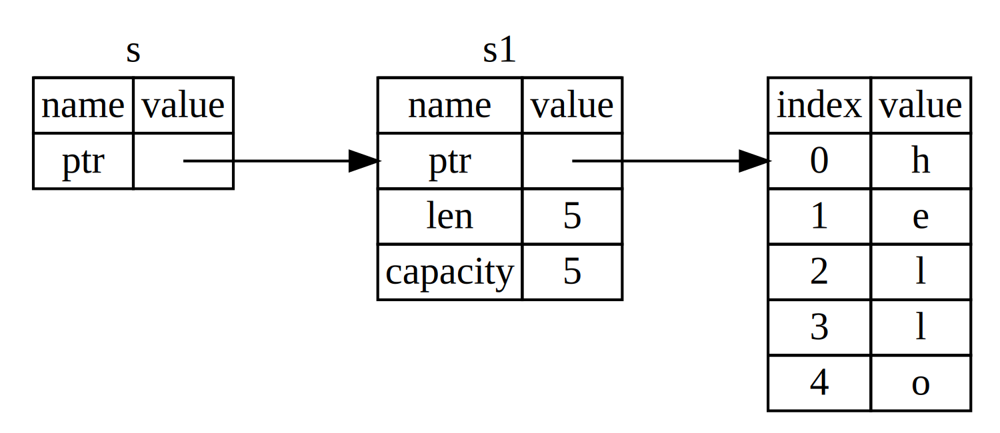

清单 4-5 中的元组代码的问题在于，我们必须将 `String` 返回给调用函数，以便在调用 `calculate_length` 后仍然可以使用 `String`，因为 `String` 被移动到了 `calculate_length` 中。相反，我们可以提供一个对 `String` 值的引用。引用就像指针一样，它是一个地址，我们可以跟随它访问存储在该地址的数据；该数据由某个其他变量拥有。与指针不同的是，引用保证在引用的生命周期内指向特定类型的有效值。

下面是你如何定义和使用一个以对象引用作为参数而不是获取值所有权的 `calculate_length` 函数：

**文件名：src/main.rs**

```rust
fn main() {
    let s1 = String::from("hello");

    let len = calculate_length(&s1);

    println!("The length of '{s1}' is {len}.");
}

fn calculate_length(s: &String) -> usize {
    s.len()
}
```

首先，注意变量声明中的元组代码和函数返回值中的元组代码都不见了。其次，注意我们向 `calculate_length` 传递 `&s1`，并且在函数定义中，我们接受 `&String` 而不是 `String`。这些 & 符号代表引用，它们允许你引用某个值而不获取其所有权。图 4-6 描绘了这个概念。



*图 4-6：`&String` `s` 指向 `String` `s1` 的示意图*

> 注意：使用 `&` 进行引用的相反操作是*解引用*，它通过解引用运算符 `*` 完成。我们将在第 8 章看到一些解引用运算符的用法，并在第 15 章详细讨论解引用。

让我们仔细看看这里的函数调用：

```rust
fn main() {
    let s1 = String::from("hello");

    let len = calculate_length(&s1);

    println!("The length of '{s1}' is {len}.");
}

fn calculate_length(s: &String) -> usize { // s 是对 String 的引用
    s.len()
} // 这里，s 离开作用域。但因为 s 没有它所引用内容的所有权，
  // 所以 String 不会被丢弃。
```

`&s1` 语法让我们创建一个*引用* `s1` 值的引用，但不拥有它。因为引用不拥有它，所以当引用停止使用时，它所指向的值不会被丢弃。

同样，函数的签名使用 `&` 来表明参数 `s` 的类型是引用。让我们添加一些解释性注释：

变量 `s` 有效的范围与任何函数参数的范围相同，但引用指向的值不会在 `s` 停止使用时被丢弃，因为 `s` 没有所有权。当函数有引用作为参数而不是实际值时，我们不需要返回值来归还所有权，因为我们从未拥有过所有权。

我们将创建引用的动作称为*借用*。就像在真实生活中，如果一个人拥有某物，你可以从他们那里借用。当你用完时，你必须归还它。你不拥有它。

那么，如果我们尝试修改我们借用的东西会发生什么？尝试清单 4-6 中的代码。剧透警告：它不起作用！

**清单 4-6**：尝试修改借用的值（文件名：src/main.rs）

```rust
fn main() {
    let s = String::from("hello");

    change(&s);
}

fn change(some_string: &String) {
    some_string.push_str(", world");
}
```

这是错误信息：

```console
$ cargo run
   Compiling ownership v0.1.0 (file:///projects/ownership)
error[E0596]: cannot borrow `*some_string` as mutable, as it is behind a `&` reference
 --> src/main.rs:8:5
  |
8 |     some_string.push_str(", world");
  |     ^^^^^^^^^^^ `some_string` is a `&` reference, so the data it refers to cannot be borrowed as mutable
  |
help: consider changing this to be a mutable reference
  |
7 | fn change(some_string: &mut String) {
  |                         +++

For more information about this error, try `rustc --explain E0596`.
error: could not compile `ownership` (bin "ownership") due to 1 previous error
```

就像变量默认是不可变的一样，引用也是如此。我们不允许修改我们有引用的东西。

## 可变引用

我们可以通过一些小的调整来修复清单 4-6 中的代码，允许我们修改借用的值，使用*可变引用*：

**文件名：src/main.rs**

```rust
fn main() {
    let mut s = String::from("hello");

    change(&mut s);
}

fn change(some_string: &mut String) {
    some_string.push_str(", world");
}
```

首先，我们将 `s` 改为 `mut`。然后，我们在调用 `change` 函数的地方用 `&mut s` 创建一个可变引用，并更新函数签名以接受可变引用 `some_string: &mut String`。这使得 `change` 函数将改变它借用的值变得非常清楚。

可变引用有一个很大的限制：如果你有一个对值的可变引用，你就不能有该值的其他引用。这段试图创建两个对 `s` 的可变引用的代码会失败：

**文件名：src/main.rs**

```rust
fn main() {
    let mut s = String::from("hello");

    let r1 = &mut s;
    let r2 = &mut s;

    println!("{r1}, {r2}");
}
```

这是错误：

```console
$ cargo run
   Compiling ownership v0.1.0 (file:///projects/ownership)
error[E0499]: cannot borrow `s` as mutable more than once at a time
 --> src/main.rs:5:14
  |
4 |     let r1 = &mut s;
  |              ------ first mutable borrow occurs here
5 |     let r2 = &mut s;
  |              ^^^^^^ second mutable borrow occurs here
6 |
7 |     println!("{r1}, {r2}");
  |                -- first borrow later used here

For more information about this error, try `rustc --explain E0499`.
error: could not compile `ownership` (bin "ownership") due to 1 previous error
```

这个错误说这段代码是无效的，因为我们不能一次借用一个可变引用超过一次。第一个可变借用是在 `r1` 中，必须持续到在 `println!` 中使用它，但在创建那个可变引用和使用它之间，我们试图在 `r2` 中创建另一个可变引用，它借用了与 `r1` 相同的数据。

防止同时有多个对相同数据的可变引用的限制允许以非常受控的方式进行可变。这是新 Rust 程序员感到困难的事情，因为大多数语言让你随时可变。拥有这个限制的好处是，Rust 可以在编译时防止数据竞争。*数据竞争*类似于竞争条件，当这三种行为发生时就会发生：

- 两个或更多指针同时访问相同的数据。
- 至少有一个指针被用来写入数据。
- 没有机制被用来同步对数据的访问。

数据竞争会导致未定义行为，当你试图在运行时追踪它们时，可能难以诊断和修复；Rust 通过拒绝编译有数据竞争的代码来防止这个问题！

像往常一样，我们可以使用花括号创建一个新的作用域，允许多个可变引用，只是不能*同时*有：

```rust
fn main() {
    let mut s = String::from("hello");

    {
        let r1 = &mut s;
    } // r1 在这里离开作用域，所以我们可以毫无问题地创建一个新的引用。

    let r2 = &mut s;
}
```

Rust 对结合可变和不可变引用强制执行类似的规则。这段代码会导致错误：

```rust
fn main() {
    let mut s = String::from("hello");

    let r1 = &s; // 没问题
    let r2 = &s; // 没问题
    let r3 = &mut s; // 大问题

    println!("{r1}, {r2}, and {r3}");
}
```

这是错误：

```console
$ cargo run
   Compiling ownership v0.1.0 (file:///projects/ownership)
error[E0502]: cannot borrow `s` as mutable because it is also borrowed as immutable
 --> src/main.rs:6:14
  |
4 |     let r1 = &s; // no problem
  |              -- immutable borrow occurs here
5 |     let r2 = &s; // no problem
6 |     let r3 = &mut s; // BIG PROBLEM
  |              ^^^^^^ mutable borrow occurs here
7 |
8 |     println!("{r1}, {r2}, and {r3}");
  |                -- immutable borrow later used here

For more information about this error, try `rustc --explain E0502`.
error: could not compile `ownership` (bin "ownership") due to 1 previous error
```

哇！当我们对同一个值有不可变引用时，我们*也*不能有一个可变引用。

不可变引用的用户不希望值突然在他们下面改变！然而，允许多个不可变引用，因为只是读取数据的人没有能力影响其他人对数据的读取。

注意，引用的范围从它被引入的地方开始，并持续到该引用最后一次使用。例如，这段代码会编译，因为不可变引用的最后一次使用是在 `println!` 中，在可变引用被引入之前：

```rust
fn main() {
    let mut s = String::from("hello");

    let r1 = &s; // 没问题
    let r2 = &s; // 没问题
    println!("{r1} and {r2}");
    // 变量 r1 和 r2 将不会在此点之后使用。

    let r3 = &mut s; // 没问题
    println!("{r3}");
}
```

不可变引用 `r1` 和 `r2` 的范围在 `println!` 之后结束，在那里它们最后一次被使用，这在可变引用 `r3` 被创建之前。这些范围不重叠，所以这段代码是允许的：编译器可以告诉引用在范围的终点之前不再被使用。

即使借用错误有时可能令人沮丧，请记住，Rust 编译器提前指出潜在的错误（在编译时而不是在运行时），并准确地显示问题所在。然后，你不必追踪为什么你的数据不是你所想的那样。

## 悬空引用

在有指针的语言中，很容易错误地创建一个*悬空指针*——一个引用可能已经给别人的内存位置的指针——通过释放一些内存而保留一个指向该内存的指针。相比之下，在 Rust 中，编译器保证引用永远不会是悬空引用：如果你有一个对某些数据的引用，编译器将确保数据不会在引用之前离开作用域。

让我们尝试创建一个悬空引用，看看 Rust 如何用编译时错误阻止它们：

**文件名：src/main.rs**

```rust
fn main() {
    let reference_to_nothing = dangle();
}

fn dangle() -> &String {
    let s = String::from("hello");

    &s
}
```

这是错误：

```console
$ cargo run
   Compiling ownership v0.1.0 (file:///projects/ownership)
error[E0106]: missing lifetime specifier
 --> src/main.rs:5:16
  |
5 | fn dangle() -> &String {
  |                ^ expected named lifetime parameter
  |
  = help: this function's return type contains a borrowed value, but there is no value for it to be borrowed from
help: consider using the `'static` lifetime, but this is uncommon unless you're returning a borrowed value from a `const` or a `static`
  |
5 | fn dangle() -> &'static String {
  |                 +++++++
help: instead, you are more likely to want to return an owned value
  |
5 - fn dangle() -> &String {
5 + fn dangle() -> String {
  |

For more information about this error, try `rustc --explain E0106`.
error: could not compile `ownership` (bin "ownership") due to 1 previous error
```

这个错误消息引用了一个我们尚未涉及的特性：生命周期。我们将在第 10 章详细讨论生命周期。但是，如果你忽略关于生命周期的部分，消息确实包含为什么这段代码是问题的关键：

```text
this function's return type contains a borrowed value, but there is no value
for it to be borrowed from
```

让我们仔细看看在我们的 `dangle` 代码的每个阶段到底发生了什么：

**文件名：src/main.rs**

```rust
fn main() {
    let reference_to_nothing = dangle();
}

fn dangle() -> &String { // dangle 返回一个对 String 的引用

    let s = String::from("hello"); // s 是一个新的 String

    &s // 我们返回对 String s 的引用
} // 这里，s 离开作用域并被丢弃，所以它的内存消失了。
  // 危险！
```

因为 `s` 是在 `dangle` 内部创建的，当 `dangle` 的代码完成时，`s` 将被释放。但我们试图返回对它的引用。这意味着这个引用将指向一个无效的 `String`。那不好！Rust 不会让我们这样做。

这里的解决方案是直接返回 `String`：

```rust
fn main() {
    let string = no_dangle();
}

fn no_dangle() -> String {
    let s = String::from("hello");

    s
}
```

这没有任何问题。所有权被移出，没有任何东西被释放。

## 引用规则

让我们回顾一下我们讨论的关于引用的内容：

- 在任何给定时间，你可以有*要么*一个可变引用*要么*任何数量的不可变引用。
- 引用必须始终有效。

接下来，我们将看看一种不同类型的引用：切片。
