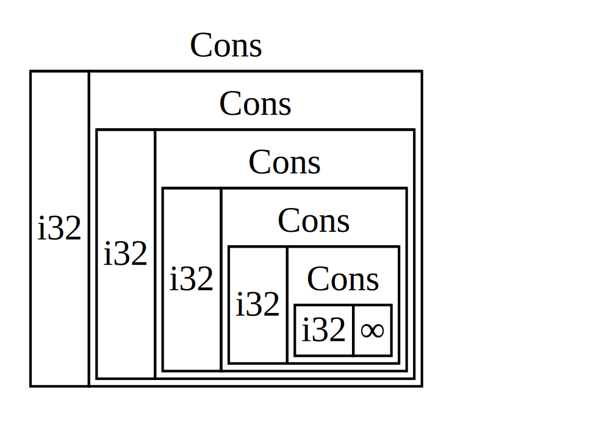

最简单的智能指针是 box，其类型写作 `Box<T>`。_Box_ 允许你将数据存储在堆上而不是栈上。留在栈上的是指向堆数据的指针。请参阅第4章回顾栈和堆的区别。

Box 除了将数据存储在堆上而不是栈上之外，没有其他性能开销。但它们也没有很多额外的能力。你将在以下情况最常使用它们：

- 当你有一个在编译时大小未知的类型，并且你想在需要确切大小的上下文中使用该类型的值时
- 当你有大量数据，并且你想转移所有权但确保这样做时数据不会被复制时
- 当你想拥有一个值，并且你只关心它实现了特定 trait 而不是特定类型时

我们将在 ["使用 Box 启用递归类型"](#使用-box-启用递归类型) 中演示第一种情况。在第二种情况下，转移大量数据的所有权可能需要很长时间，因为数据在栈上被复制。为了在这种情况下提高性能，我们可以将大量数据存储在堆上的 box 中。然后，只有少量指针数据在栈上被复制，而它所引用的数据保持在堆上的一个位置。第三种情况被称为  _trait 对象_ ，第18章的 ["使用 Trait 对象抽象共享行为"][trait-objects] 专门讨论该主题。因此，你在这里学到的东西将在那一节再次应用！

### 在堆上存储数据

在讨论 `Box<T>` 的堆存储用例之前，我们将介绍语法以及如何与存储在 `Box<T>` 中的值交互。

**代码示例 15-1**：使用 box 在堆上存储一个 `i32` 值

```rust
fn main() {
    let b = Box::new(5);
    println!("b = {b}");
}
```

我们将变量 `b` 定义为指向值 `5` 的 `Box`，该值分配在堆上。该程序将打印 `b = 5`；在这种情况下，我们可以类似访问栈上数据的方式访问 box 中的数据。就像任何拥有的值一样，当 box 超出作用域时，如 `b` 在 `main` 结束时所做的那样，它将被释放。释放同时发生在 box（存储在栈上）和它指向的数据（存储在堆上）。

在堆上放置单个值并不是很有用，所以你不会经常单独使用 box。在大多数情况下，将值（如单个 `i32`）存储在它们默认存储的栈上更合适。让我们看一个 box 允许我们定义如果不使用 box 就无法定义的类型的案例。

### 使用 Box 启用递归类型

_递归类型_ 的值可以将同类型的另一个值作为自身的一部分。递归类型存在一个问题，因为 Rust 需要在编译时知道一个类型占用多少空间。然而，递归类型的值的嵌套理论上可以无限继续，所以 Rust 无法知道该值需要多少空间。因为 box 有已知的大小，我们可以通过将 box 插入递归类型定义中来启用递归类型。

作为递归类型的示例，让我们探索 cons list。这是一种在函数式编程语言中常见的数据类型。我们将定义的 cons list 类型是简单的，除了递归之外；因此，我们将在示例中处理的概念在你遇到涉及递归类型的更复杂情况时都将很有用。

#### 理解 Cons List

_cons list_ 是一种来自 Lisp 编程语言及其方言的数据结构，由嵌套对组成，是 Lisp 版本的链表。它的名字来自 Lisp 中的 `cons` 函数（_construct function_ 的缩写），该函数从其两个参数构造一个新对。通过在由值和对组成的对上调用 `cons`，我们可以构造由递归对组成的 cons list。

例如，这里是一个包含列表 `1, 2, 3` 的 cons list 的伪代码表示，每个对在括号中：

```text
(1, (2, (3, Nil)))
```

cons list 中的每个项包含两个元素：当前项的值和下一个项的值。列表中的最后一项只包含一个名为 `Nil` 的值，没有下一项。cons list 是通过递归调用 `cons` 函数产生的。表示递归基例的规范名称是 `Nil`。注意，这与第6章讨论的 "null" 或 "nil" 概念不同，后者是无效或缺失的值。

cons list 并不是 Rust 中常用的数据结构。大多数时候，当你在 Rust 中有一个项目列表时，`Vec<T>` 是更好的选择。其他更复杂的递归数据类型 _确实_ 在各种情况下有用，但从本章的 cons list 开始，我们可以探索 box 如何让我们定义递归数据类型，而不会被太多干扰分散注意力。

清单 15-2 包含一个 cons list 的枚举定义。注意这段代码还无法编译，因为 `List` 类型没有已知的大小，我们将演示这一点。

**代码示例 15-2**：首次尝试定义一个枚举来表示 `i32` 值的 cons list 数据结构

```rust
enum List {
    Cons(i32, List),
    Nil,
}

fn main() {}
```

> 注意：在本示例中，我们实现了一个只保存 `i32` 值的 cons list。我们可以使用泛型来实现它，正如我们在第10章讨论的那样，以定义一个可以存储任何类型值的 cons list 类型。

使用 `List` 类型来存储列表 `1, 2, 3` 看起来会像清单 15-3 中的代码。

**代码示例 15-3**：使用 `List` 枚举来存储列表 `1, 2, 3`

```rust
enum List {
    Cons(i32, List),
    Nil,
}

use crate::List::{Cons, Nil};

fn main() {
    let list = Cons(1, Cons(2, Cons(3, Nil)));
}
```

第一个 `Cons` 值保存 `1` 和另一个 `List` 值。这个 `List` 值是另一个保存 `2` 和另一个 `List` 值的 `Cons` 值。这个 `List` 值是另一个保存 `3` 和一个 `List` 值的 `Cons` 值，最后一个是 `Nil`，表示列表结束的非递归变体。

如果我们尝试编译清单 15-3 中的代码，我们会得到清单 15-4 中显示的错误。

**代码示例 15-4**：尝试定义递归枚举时得到的错误

```console
$ cargo run
   Compiling cons-list v0.1.0 (file:///projects/cons-list)
error[E0072]: recursive type `List` has infinite size
 --> src/main.rs:1:1
  |
1 | enum List {
  | ^^^^^^^^^
2 |     Cons(i32, List),
  |               ---- recursive without indirection
  |
help: insert some indirection (e.g., a `Box`, `Rc`, or `&`) to break the cycle
  |
2 |     Cons(i32, Box<List>),
  |               ++++    +

error[E0391]: cycle detected when computing when `List` needs drop
 --> src/main.rs:1:1
  |
1 | enum List {
  | ^^^^^^^^^
  |
  = note: ...which immediately requires computing when `List` needs drop again
  = note: cycle used when computing whether `List` needs drop
  = note: see https://rustc-dev-guide.rust-lang.org/overview.html#queries and https://rustc-dev-guide.rust-lang.org/query.html for more information

Some errors have detailed explanations: E0072, E0391.
For more information about an error, try `rustc --explain E0072`.
error: could not compile `cons-list` (bin "cons-list") due to 2 previous errors
```

错误显示此类型 "具有无限大小"。原因是我们定义了一个递归变体的 `List`：它直接持有自身的另一个值。结果，Rust 无法弄清楚存储 `List` 值需要多少空间。让我们分解一下我们得到这个错误的原因。首先，我们将看看 Rust 如何决定存储非递归类型的值需要多少空间。

#### 计算非递归类型的大小

回想一下我们在第6章讨论枚举定义时定义的 `Message` 枚举，如清单 6-2 所示：

```rust
enum Message {
    Quit,
    Move { x: i32, y: i32 },
    Write(String),
    ChangeColor(i32, i32, i32),
}
```

为了确定为 `Message` 值分配多少空间，Rust 遍历每个变体以查看哪个变体需要最多的空间。Rust 看到 `Message::Quit` 不需要任何空间，`Message::Move` 需要足够的空间来存储两个 `i32` 值，等等。因为只会使用一个变体，`Message` 值需要的最大空间是存储其最大变体所需的空间。

与此对比，当 Rust 尝试确定清单 15-2 中的 `List` 这样的递归类型需要多少空间时会发生什么。编译器从查看 `Cons` 变体开始，它持有一个 `i32` 类型的值和一个 `List` 类型的值。因此，`Cons` 需要的空间等于一个 `i32` 的大小加上一个 `List` 的大小。为了弄清楚 `List` 类型需要多少内存，编译器查看变体，从 `Cons` 变体开始。`Cons` 变体持有一个 `i32` 类型的值和一个 `List` 类型的值，这个过程无限继续，如图 15-1 所示。



**图 15-1**：一个无限的 `List`，由无限的 `Cons` 变体组成

#### 获取具有已知大小的递归类型

因为 Rust 无法弄清楚为递归定义的类型分配多少空间，编译器会给出错误并提供这个有用的建议：

```text
help: insert some indirection (e.g., a `Box`, `Rc`, or `&`) to break the cycle
  |
2 |     Cons(i32, Box<List>),
  |               ++++    +
```

在这个建议中， _间接_ 意味着我们应该改变数据结构，通过存储指向值的指针而不是直接存储值来间接存储值。

因为 `Box<T>` 是一个指针，Rust 总是知道 `Box<T>` 需要多少空间：指针的大小不会根据它指向的数据量而改变。这意味着我们可以在 `Cons` 变体中放入一个 `Box<T>` 而不是直接放入另一个 `List` 值。`Box<T>` 将指向堆上的下一个 `List` 值，而不是在 `Cons` 变体内部。从概念上讲，我们仍然有一个列表，由保存其他列表的列表创建，但这种实现现在更像是将项目彼此相邻放置，而不是在彼此内部放置。

我们可以将清单 15-2 中的 `List` 枚举定义和清单 15-3 中的 `List` 用法更改为清单 15-5 中的代码，这将编译。

**代码示例 15-5**：使用 `Box<T>` 来具有已知大小的 `List` 定义

```rust
enum List {
    Cons(i32, Box<List>),
    Nil,
}

use crate::List::{Cons, Nil};

fn main() {
    let list = Cons(1, Box::new(Cons(2, Box::new(Cons(3, Box::new(Nil))))));
}
```

`Cons` 变体需要一个 `i32` 的大小加上存储 box 指针数据的空间。`Nil` 变体不存储任何值，因此它在栈上需要的空间比 `Cons` 变体少。我们现在知道任何 `List` 值将占用一个 `i32` 的大小加上一个 box 指针数据的大小。通过使用 box，我们打破了无限递归链，因此编译器可以弄清楚存储 `List` 值需要的大小。图 15-2 显示了 `Cons` 变体现在看起来是什么样的。


**图 15-2**：一个不是无限大小的 `List`，因为 `Cons` 持有一个 `Box`

Box 只提供间接和堆分配；它们没有其他特殊能力，就像我们在其他智能指针类型中看到的那样。它们也没有这些特殊能力带来的性能开销，因此它们在 cons list 等情况下很有用，在这些情况下，间接是我们唯一需要的功能。我们将在第18章中查看更多 box 的用例。

`Box<T>` 类型是一种智能指针，因为它实现了 `Deref` trait，这允许 `Box<T>` 值被当作引用处理。当 `Box<T>` 值超出作用域时，box 指向的堆数据也会被清理，因为 `Drop` trait 实现。这两个 trait 对我们将在本章其余部分讨论的其他智能指针类型提供的功能更为重要。让我们更详细地探讨这两个 trait。

[trait-objects]: /rust-book/ch18-02-trait-objects#使用-trait-对象抽象共享行为
