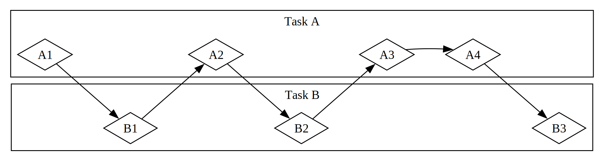

我们让计算机执行的许多操作可能需要一段时间才能完成。如果在等待这些长时间运行的进程完成时能做其他事情，那就太好了。现代计算机提供了两种同时处理多个操作的技术：并行和并发。然而，我们程序的逻辑主要是线性编写的。我们希望能够指定程序应该执行的操作，以及函数可以在哪些点暂停并让程序的其他部分运行，而不需要预先指定每段代码应该以何种顺序和方式运行。*异步编程* 是一种抽象，它让我们能够以潜在的暂停点和最终结果来表达代码，并为我们处理协调的细节。

本章在第16章使用线程进行并行和并发的基础上，介绍了一种编写代码的替代方法：Rust 的 futures、streams 以及 `async` 和 `await` 语法，让我们能够表达操作如何可以是异步的，还有实现异步运行时的第三方 crate：管理和协调异步操作执行的代码。

让我们考虑一个例子。假设你正在导出你创建的家庭庆祝视频，这个操作可能需要几分钟到几小时不等。视频导出将尽可能多地使用 CPU 和 GPU 能力。如果你只有一个 CPU 核心，而且你的操作系统不会暂停那个导出直到它完成——也就是说，如果它 *同步* 地执行导出——你在那个任务运行时就无法在计算机上做任何事情。那将是一个相当令人沮丧的体验。幸运的是，你计算机的操作系统可以，也确实会，不可见地中断导出，足够频繁地让你同时完成其他工作。

现在假设你正在下载别人分享的视频，这也可能需要一段时间，但不会占用太多 CPU 时间。在这种情况下，CPU 必须等待数据从网络到达。一旦数据开始到达你就可以开始读取，但可能需要一些时间才能全部显示出来。即使所有数据都到达了，如果视频很大，加载所有内容也可能需要一两秒钟。这可能听起来不多，但对于现代处理器来说，这是一段很长的时间，它每秒可以执行数十亿次操作。同样，你的操作系统会不可见地中断你的程序，允许 CPU 在等待网络调用完成的同时执行其他工作。

视频导出是 *CPU 密集型* 或 *计算密集型* 操作的一个例子。它受限于 CPU 或 GPU 内计算机潜在数据处理速度的限制，以及它可以为该操作投入多少速度。视频下载是 *I/O 密集型* 操作的一个例子，因为它受限于计算机 *输入和输出* 的速度；它只能以数据通过网络发送的速度进行。

在这两个例子中，操作系统的不可见中断提供了一种并发形式。不过，这种并发只发生在整个程序的层面：操作系统中断一个程序以让其他程序完成工作。在很多情况下，因为我们对程序的理解比操作系统更细致，我们能够发现操作系统看不到的并发机会。

例如，如果我们正在构建一个管理文件下载的工具，我们应该能够编写我们的程序，使得开始一个下载不会锁定 UI，而且用户应该能够同时开始多个下载。然而，许多操作系统用于与网络交互的 API 是 *阻塞* 的；也就是说，它们会阻塞程序的进度，直到它们处理的数据完全准备好。

> 注意：如果你仔细想想，这就是 *大多数* 函数调用的工作方式。然而，术语 *阻塞* 通常保留用于与文件、网络或计算机上其他资源交互的函数调用，因为这些是单个程序会从操作变为 *非* 阻塞中受益的情况。

我们可以通过生成一个专用线程来下载每个文件来避免阻塞我们的主线程。然而，这些线程使用的系统资源开销最终会成为问题。如果调用本身就不会阻塞，而是更好，我们可以定义我们希望程序完成的一系列任务，并允许运行时选择运行它们的最佳顺序和方式。

这正是 Rust 的 *async*（*asynchronous* 的缩写）抽象给我们的。在本章中，你将学习关于 async 的所有内容，涵盖以下主题：

- 如何使用 Rust 的 `async` 和 `await` 语法，并使用运行时执行异步函数
- 如何使用 async 模型解决我们在第16章中看到的一些相同挑战
- 多线程和 async 如何提供互补的解决方案，你可以在许多情况下结合使用

不过，在我们看到 async 如何在实践中工作之前，我们需要稍微绕个弯子来讨论并行和并发之间的区别。

## 并行和并发

到目前为止，我们基本上将并行和并发视为可互换的。现在我们需要更精确地区分它们，因为当我们开始工作时，这些差异会显现出来。

考虑一个团队分配软件开发工作的不同方式。你可以给单个成员分配多个任务，给每个成员分配一个任务，或者混合使用这两种方法。

当一个人在任何任务完成之前处理几个不同的任务时，这就是 *并发* 。实现并发的一种方式是类似于你的计算机上有两个不同的项目检出，当你对一个项目感到无聊或卡住时，你切换到另一个项目。你只是一个人，所以你不能同时在两个任务上取得进展，但你可以通过切换来多任务处理，一次在一个任务上取得进展（见图 17-1）。

**图 17-1**：一个并发工作流，在任务 A 和任务 B 之间切换

当团队通过让每个成员承担一个任务并独自完成来分配一组任务时，这就是 *并行* 。团队中的每个人都可以在同一时间取得进展（见图 17-2）。

**图 17-2**：一个并行工作流，任务 A 和任务 B 独立进行

在这两种工作流中，你可能需要在不同任务之间进行协调。也许你分配给一个人的任务实际上需要团队中另一个人先完成他们的任务。有些工作可以并行完成，但有些实际上是 *串行* 的：它只能以一系列方式进行，一个接一个，如图 17-3 所示。

**图 17-3**：一个部分并行的工作流，任务 A 和任务 B 独立进行，直到任务 A3 被任务 B3 的结果阻塞

同样，你可能会意识到你自己的一个任务依赖于你的另一个任务。现在你并发的任务也变得串行了。

并行和并发也可以相互交叉。如果你得知一个同事被你卡住，直到你完成某个任务，你可能会把所有精力都集中在这个任务上以"解阻塞"你的同事。你和你的同事不再能够并行工作，你也不再能够在你自己的任务上并发工作。

软件和硬件也具有相同的基本动态。在单 CPU 核心的机器上，CPU 一次只能执行一个操作，但它仍然可以并发工作。使用线程、进程和 async 等工具，计算机可以暂停一个活动并切换到其他活动，然后再最终循环回到第一个活动。在多 CPU 核心的机器上，它还可以并行工作。一个核心可以执行一个任务，而另一个核心执行一个完全无关的任务，这些操作实际上同时发生。

在 Rust 中运行 async 代码通常发生在并发环境中。根据硬件、操作系统和我们正在使用的 async 运行时（稍后会有更多关于 async 运行时的内容），这种并发也可能在底层使用并行。

现在，让我们深入了解 Rust 中异步编程的实际工作原理。
